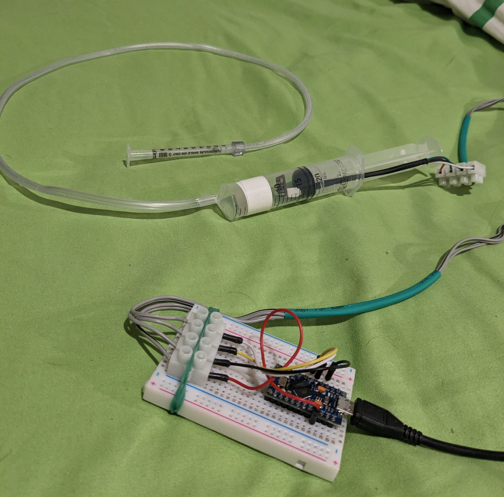

# Midi Blows!!

An Arduino USB Breath Controller using cheap as components. Surprisingly intuitive to use :)

Ingredients:

- 1x Arduino Pro Micro
- 1x BME280 Pressure Sensor
- 1x 20ml Syringe as a pressure container for the sensor
- Some thin Tubing + Mouth piece to blow into. I used another smaller syringe for that

## Software Mapping

- Some VST have an expression control to map the controller to. If not, maybe just map it to the instrument's volume or filter cutoff frequency.
- Wind instruments and Strings work really well!

## Build Details and Possible Improvements

- Air escape hole location and sizes can vary. Currently the air hole in my prototype has been drilled into the bottom area of the mouth piece (about 3mm size), not the pressure container. That seems to work quite well.
- Further tweaking the Oversampling and Filter settings for the sensor could reduce latency even more. It is very responsive already though.
- Tubing diameter and pressure container design could be experimented with.
- The pressure container volume can easily be changed with the syringe plunger with changes the responsiveness and required blowing force.

## Links

- [Video with Sound](https://youtu.be/7HZMLERt6Gc) Sorry, I am neither a woodwind, nor a piano player 😝
- [Datasheet](https://www.bosch-sensortec.com/products/environmental-sensors/humidity-sensors-bme280/#documents) for the BME280
- Commercially available USB Breath controller for comparison from [Tecontrol](https://www.tecontrol.se/products/usb-midi-breath-controller) (Quite pricey!)

---

